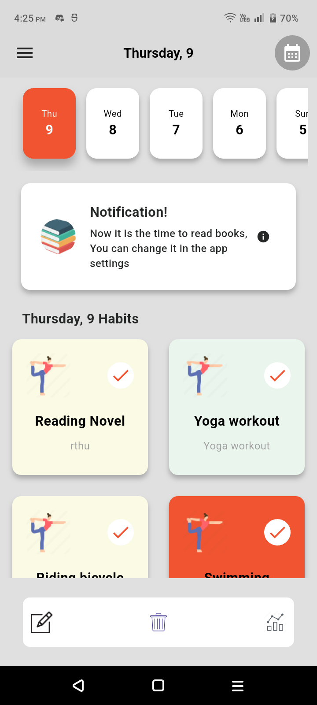

# Habit Tracker

## 🛠️💻 Inspiration Design UI

Below is the Dribble UI Link inspiration for this app
- [View UI Designs](https://dribbble.com/shots/18932568-Morin-Habit-Tracker-App)

## Project Description

A **Flutter** application that allows you to track your habits.

- Excellent and light UI performance.
- Has **Light** and **Dark** modes.
- Features **Heatmaps** and **Calendar** to track your streaks.
- Allows you to **delete** and **edit** your habits from the existing list.
- Option to **create a new habit cardlist**.
- **Log** of your habit completions.
- Supports **Gmail sign-in** and **sign-up**.
- Has **Notification** reminders to help you keep track of your daily goals.
- Available on the **Amazon App Store**.

## 🚀 Features

- **Habit Tracking**: Easily track your habits and mark them as completed each day.
- **Light and Dark Mode**: Toggle between light and dark themes.
- **Heatmaps & Calendar**: Visualize your habit streaks using heatmaps and calendar views.
- **Habit Management**: Edit or delete existing habits, and create new habit cards.
- **Habit Log**: View a detailed log of completed habits.
- **Gmail Sign-In & Sign-Up**: Convenient authentication using Gmail.
- **Notifications**: Get daily reminders to help you stay on track.

## 🛠 How to Run the Project


### Project structure 

## Project structure

```plaintext
habit-tracker/
├── .github/               # contains the github workflows
├── android/               # Android-specific project files
├── assets/                # Asset files (images)
├── ios/                   # iOS-specific project files
├── lib/                   # Main source code for the app
│   ├── components/        # Contains reusable widget components, with global widget having almost all the components
│   ├── database/          # Contains the offline SQLite, shared preferences, and REST API methods
│   ├── models/            # Contains the Habit models and the gamification models
│   ├── pages/             # Contains the auth pages (sign in and sign up), home, choosing habit, and analytical pages
│   ├── theme/             # Contains the themes (light and dark theming)
│   ├── util/              # Contains colors, constants, functions, text styles
│   └── main.dart          # Entry point of the app
├── screenshots/           # Contains the app UI screenshots
├── test/                  # Unit tests for the app (has the sync test)
├── pubspec.yaml           # Flutter project configuration and dependencies
└── README.md              # Project documentation (The file you are reading)
```

### Prerequisites

Before running the project, make sure you have the following tools installed on your system:

- **Flutter**: Download and install Flutter from [flutter.dev](https://flutter.dev/docs/get-started/install).
- **Android Studio** or **VS Code**: Recommended IDEs for Flutter development.

### Steps to Run

1. **Clone the Repository**
   ```bash
   git clone https://github.com/kev254/habit-tracker.git
   cd habit-tracker
   flutter pub get
   flutter run
   
### Runnng the test
   ```bash
   flutter test
   ```
   
## 🔗 Links

- [Download APK](https://github.com/kev254/habit_tracker/releases/download/v1.1.0/app-release.apk)

## Screenshots
## Screenshots

|  |   |  |
|---------------------------------------------------------|----------------------------------------------------------|----------------------------------------------------------|
|  |   |   |
|  |   |   |
|  |  |  |


## 🦸‍♂️💼 Developer Info

Web and Mobile App Enthusiast
- [Go to portifolio](https://okombakevin.co.ke)
